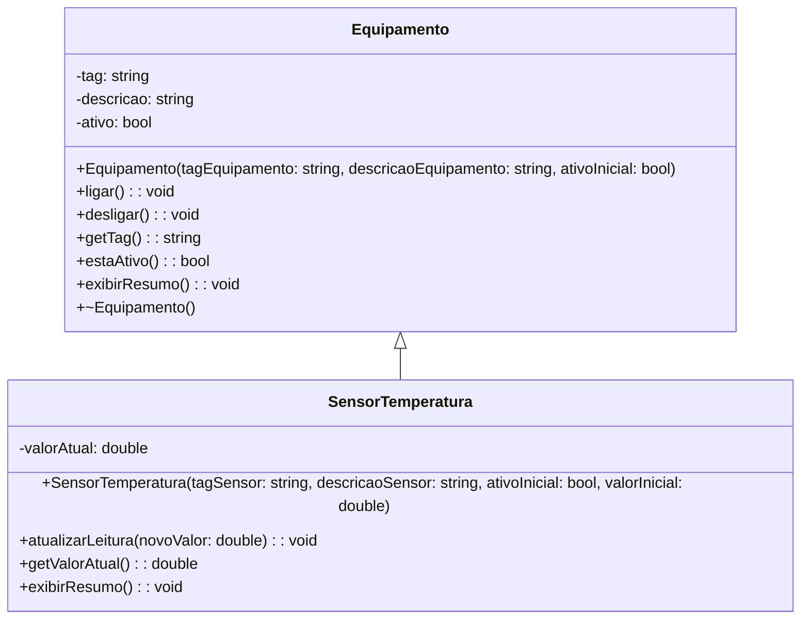

# Diagrama UML - Codigo C++

## 1. Arquivos analisados

- `src_cpp/main.cpp`
- `src_cpp/equipamento.hpp`
- `src_cpp/equipamento.cpp`
- `src_cpp/sensor_temperatura.hpp`
- `src_cpp/sensor_temperatura.cpp`

## 2. Link do Mermaid Live

https://mermaid.ai/d/d842d96b-a9e4-4fd5-993d-9e0ea3714c72

## 3. Diagrama final em Mermaid

## 4. Justificativa tecnica

-Classes identificadas: Foram identificadas duas classes principais através dos ficheiros .hpp: Equipamento e SensorTemperatura.

-Herança: A herança é evidenciada no código pela declaração class SensorTemperatura : public Equipamento, o que justifica a seta de generalização (<|--) no diagrama.

-Operações em destaque: O método exibirResumo() destaca-se por ser virtual na classe mãe e subscrito (override) na classe filha, demonstrando polimorfismo. Além disso, os construtores de inicialização e os métodos Getters também foram mapeados.

-Por que o UML está correto: O diagrama reflete exatamente o encapsulamento definido no código (atributos privados com - e métodos públicos com +), os tipos de dados passados nos parâmetros e a relação correta de hierarquia entre as classes.

## 5. Evidencias

$g++ -std=c++17 -Wall -Wextra -O2 src_cpp/main.cpp src_cpp/equipamento.cpp src_cpp/sensor_temperatura.cpp -o laboratorio$ ./laboratorio
[Equipamento] EQ-01 - Agitador principal - ativo=sim
[SensorTemperatura] TT-01 - valorAtual=23.5
[SensorTemperatura] TT-01 - valorAtual=24.2
