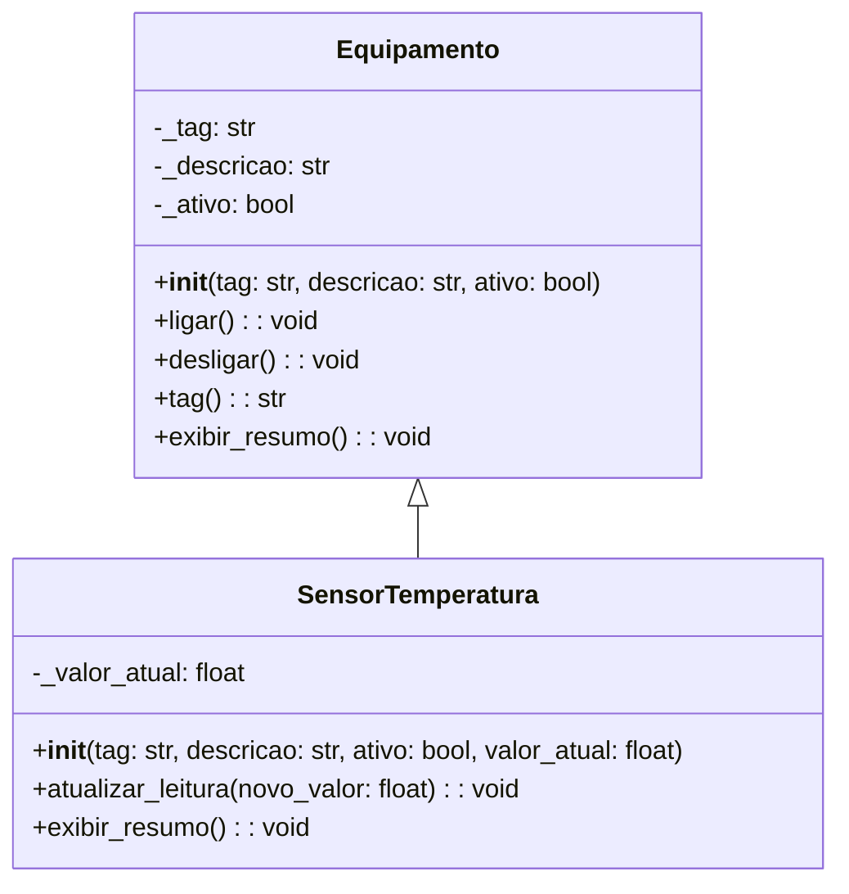

# Diagrama UML - Codigo Python

## 1. Arquivos analisados

- `src_python/main.py`
- `src_python/equipamento.py`
- `src_python/sensor_temperatura.py`

## 2. Link do Mermaid Live

https://mermaid.ai/d/2f9fc0e1-5db8-4b22-914d-14074c0cd093

## 3. Diagrama final em Mermaid

## 4. Justificativa tecnica

-Classes identificadas: As duas classes mapeadas foram Equipamento (classe base) e SensorTemperatura (classe derivada).

-Relacões: A herança é explícita na definição class SensorTemperatura(Equipamento):. O uso do super().__init__() confirma que a classe filha reaproveita a inicialização da classe mãe.

-Operações em destaque: Destaque para o método __init__, que é o construtor padrão em Python. O método tag() na classe base, apesar de ser um property no código, foi modelado como um método público que devolve uma string.

-Diferenças de Sintaxe: Os atributos foram modelados com o prefixo _ (ex: _tag), refletindo a convenção do Python para atributos fracamente privados/protegidos, mapeados com - no UML para indicar encapsulamento.

## 5. Evidencias

$ python3 src_python/main.py
[Equipamento] EQ-01 - Agitador principal - ativo=True
[SensorTemperatura] TT-01 - valorAtual=23.5
[SensorTemperatura] TT-01 - valorAtual=24.2
